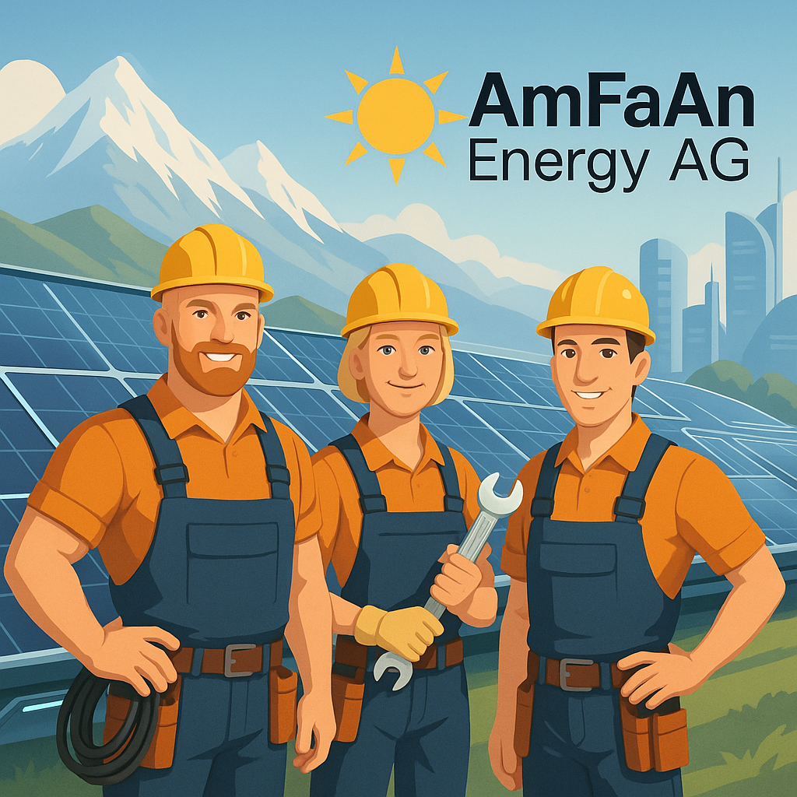

## Management Summary

Die **AmFaAn Energy AG** ist ein neu gegründetes, datengetriebenes Solarunternehmen mit Sitz in Bern. Ziel ist es, das ungenutzte Solarpotenzial in der Schweiz systematisch zu erschliessen und intelligente, lokal angepasste PV-Lösungen für Privatpersonen, Unternehmen und öffentliche Institutionen bereitzustellen.

Die Schweiz steht vor einer energiepolitischen Transformation: Bis 2050 sollen Atomkraftwerke ersetzt, die Elektrifizierung vorangetrieben und CO₂-Emissionen drastisch gesenkt werden. Die Photovoltaik wird dabei zur tragenden Säule – doch noch immer ist über 75 % des Potenzials auf Gebäuden ungenutzt.

Unsere datenbasierte Analyse (2015–2024) zeigt: Kantone wie **Bern, Zürich, Aargau und Waadt** bieten durch hohe Einstrahlungswerte, grosse Dachflächenreserven und attraktive Förderprogramme ideale Voraussetzungen für ein schnelles Wachstum. Gleichzeitig fehlen dort spezialisierte, skalierbare Anbieter mit datengetriebenem Geschäftsansatz.

Die **AmFaAn Energy AG** schliesst diese Lücke:

- **Marktzugang durch Datenintelligenz**: Identifikation profitabler Standorte & Kundensegmente via KI-gestützter Potenzialanalysen  
- **Modularer Lösungsansatz**: PV-Anlagen, Speicher, Smart-Metering & E-Mobility aus einer Hand  
- **Schnelle Skalierbarkeit**: Kooperationen mit lokalen Installateuren & Gemeinden

Die im Rahmen dieser Fallstudie entwickelte Strategie prognostiziert eine **Verdreifachung der installierten PV-Leistung in der Schweiz bis 2030**. Die AmFaAn Energy AG positioniert sich als **First Mover** in ausgewählten Regionen mit hohem Potenzial und geringem Wettbewerb.

> **Investoren erhalten Zugang zu einem stark wachsenden Markt mit planbaren Fördermechanismen, steigender Nachfrage und gesellschaftlichem Rückenwind.**  
> Die AmFaAn Energy AG ist bereit, diese Chance zu nutzen – **datenbasiert, regional fokussiert und unternehmerisch mutig**.

  

    <h2>Management Summary</h2>
    

      Die <strong>AmFaAn Energy AG</strong> ist ein neu gegründetes, datengesteuertes Solarunternehmen mit Sitz in Bern...
    

    <!-- Weitere Absätze hier -->
  

  

    
    
Erstellt mit ChatGPT

  

