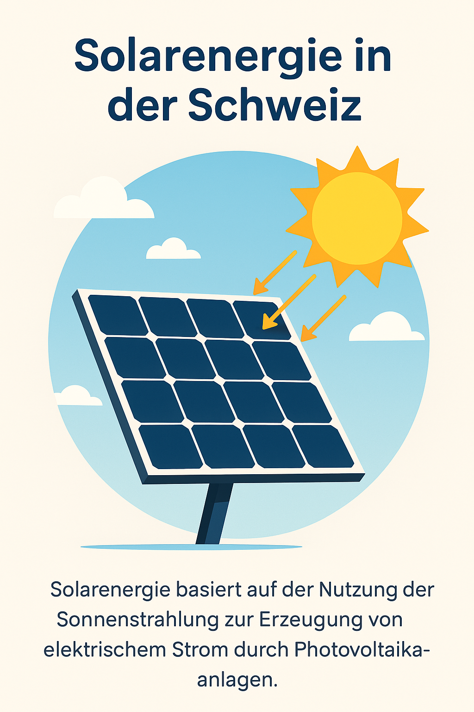

## Einleitung

    
    
"Erstellt mit ChatGPT"

In den letzten Jahren hat die Solarenergie weltweit an Bedeutung gewonnen, und auch in der Schweiz zeigt sich ein bemerkenswerter Aufwärtstrend. Diese Fallstudie untersucht das Potenzial der Solarenergie in der Schweiz, analysiert die Entwicklungen der letzten zehn Jahre und wagt einen Blick in die Zukunft. Dabei wird zunächst die Funktionsweise der Solarenergie erläutert und aufgezeigt, warum diese erneuerbare Energiequelle besonders sinnvoll für die Schweiz ist.

Solarenergie basiert auf der Nutzung der Sonnenstrahlung zur Erzeugung von elektrischem Strom. Dies geschieht durch Photovoltaikanlagen, die Sonnenlicht direkt in elektrische Energie umwandeln. Die Solarzellen, meist aus Silizium, nutzen den photovoltaischen Effekt, bei dem Licht Elektronen freisetzt und somit eine elektrische Spannung erzeugt. Diese Technologie hat sich in den letzten Jahren stark weiterentwickelt und bietet heute hohe Wirkungsgrade und wirtschaftliche Vorteile.

Die Schweiz, mit ihren zahlreichen Sonnenstunden und der zunehmenden Notwendigkeit, fossile Brennstoffe zu ersetzen, bietet ideale Bedingungen für die Nutzung von Solarenergie. Die Vorteile sind vielfältig: Solarenergie ist umweltfreundlich, reduziert die Abhängigkeit von importierten Energieträgern und trägt zur Stabilisierung der Strompreise bei. Zudem unterstützt die Schweizer Regierung den Ausbau erneuerbarer Energien durch verschiedene Förderprogramme und steuerliche Anreize.

Diese Fallstudie wird die Entwicklung der Solarenergie in der Schweiz in den letzten zehn Jahren detailliert analysieren und eine Prognose für die kommenden Jahre erstellen. Ziel ist es, das Potenzial dieser nachhaltigen Energiequelle aufzuzeigen und ihre Bedeutung für die zukünftige Energieversorgung der Schweiz zu unterstreichen.